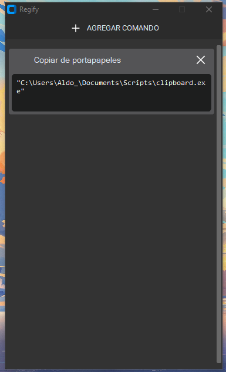
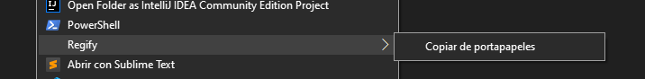

# Regify

Es una herramienta que facilita al usuario agregar comandos al menu contextual de Windows 10.

## Instalación

Puede descargar el instalador en la pagina de [releases](https://github.com/TaTo30/Regify/releases) o haga click [aquí](https://github.com/TaTo30/Regify/releases/download/v1.0.0/Regify.exe) para descargar la última versión.

## ¿Como usar?

> NOTA: para este ejemplo se usará el script para copiar el contenido del portapapeles a un archivo. ([Descargar](https://github.com/TaTo30/Regify/releases/download/v1.0.0/clipboard.exe))

- Abra la aplicación de Regify instalada, la aplicación le solicitará permisos de administrador.

- Abierta la aplicacion, de click sobre el botón de `agregar comando`.

- En el form para crear un comando tiene disponible las siguientes opciones:
   
   1. **Nombre del comando**: Asigna un nombre al comando. *(para el caso del ejemplo se pondrá "Copiar de portapapeles")*
   2. **Comando**: El comando que se desea ejecutar. *(por lo regular se pone la ruta del ejecutable y las opciones y parametros que el ejecutable soporte, para el caso del ejemplo solo es necesario la ruta del ejecutable)*
   3. **Seleccionar Icono**: Permite agregarle un icono al comando.
   4. **Multiples items**: Habilita la variable `%FILES` para comandos que requieran una lista de elementos seleccionados, por ejemplo, si dos archivos son seleccionados y se ejecuta el comando `"C:/app.exe" "--files" %FILES`, el resultado final sera el siguiente `"C:/app.exe" "--files" "C:/archivo1.txt" "C:/archivo2.txt"`.
   5. **Crear**: Boton que insertará el comando al Registro de Windows. 

- Una vez creado el comando puede dar click sobre el boton `Ver lista de comandos`, vera el comando recién creado.

- Si da click derecho sobre el escritorio o sobre el explorador de archivos, vera el comando creado en su lista de comandos del menu contextual bajo el menu `Regify`

- Para probar el script realice una captura de pantalla o copie algún texto y ejecute el comando de `Copiar de portapapeles` desde el menu contextual, vera en la carpeta donde ejecuto el comando, un archivo con el contenido del portapapeles.